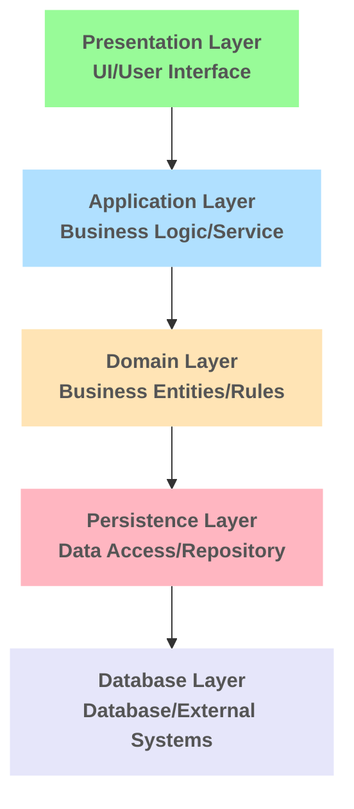
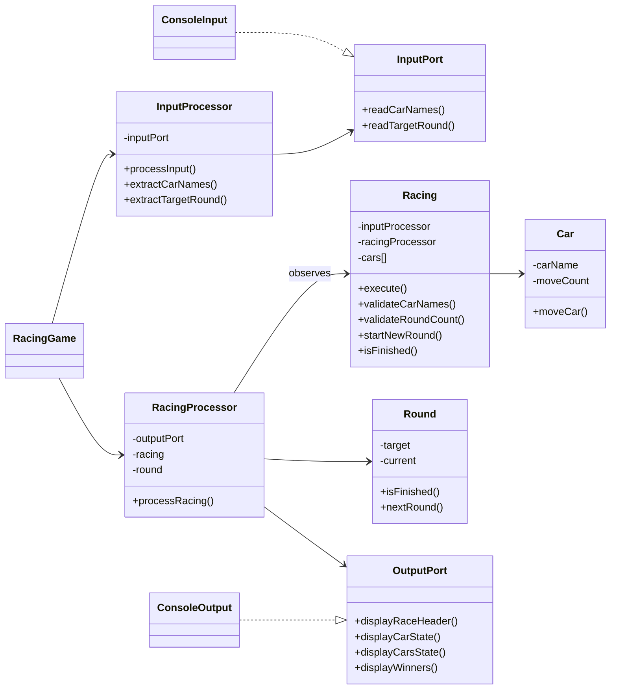

# javascript-racingcar-precourse

## 기능 목록

### Presentaion Layer

- [x] 입력 프롬프트를 띄우고 자동차 이름 및 시도할 횟수에 대한 입력을 받는 기능

### Application Layer

- [x] **Presentation Layer**의 입력값을 처리하는 기능 

  * [x] 입력된 Raw Input의 유효성을 검증하는 기능 (validation)
    +  입력값은 공백이 될 수 없다.
    +  이를 만족하지 못한 경우, '[ERROR]'로 시작하는 에러 메세지를 출력하며 프로그램을 종료한다. 
  
  * [x] 쉼표(,)를 기준으로 자동차 이름을 분리하는 기능 (utils)

- [x] 처리한 입력값을 **Domain Layer**에 전달하는 기능

### Domain Layer

- [x] **Car Domain**

  * [x] ```Car Class``` 구현

  * [x] 자동차 이름에 대한 유효성을 검증하는 기능 (validation)
    +  자동차의 이름은 1자 이상, 5자 이하이다.
    +  이를 만족하지 못한 경우, '[ERROR]'로 시작하는 에러 메세지를 출력하며 프로그램을 종료한다. 
  
  * [x] 자동차가 전진 또는 정지하는 기능
    + 각 회차 마다 자동차가 전진하는 조건은 0에서 9 사이에서 무작위 값을 구한 후 무작위 값이 4 이상일 경우이다.

- [x] **Racing Cars Domain**

  * [x] ```Racing Car``` class 구현

  * [x ] 레이싱에 출전할 자동차들의 Car Class를 각각 생성하고, 유효성을 검증하는 기능 (create & validation)
    - 자동차의 이름들은 중복이 허용되지 않는다.
    - 이를 만족하지 못한 경우, '[ERROR]'로 시작하는 에러 메세지를 출력하며 프로그램을 종료한다. 

  * [x] 각각의 자동차들을 한번에 움직이는 기능

- [x] **Round Domain** 

  * [x] ```Round claas``` 구현

  * [x] 시도할 횟수(Target Round)에 대한 유효성을 확인하는 기능 (validation)
    - 시도할 횟수는 양의 정수여야 한다.
    - 이를 만족하지 못한 경우, '[ERROR]'로 시작하는 에러 메세지를 출력하며 프로그램을 종료한다.

  * [x] 현재 라운드와 목표 라운드를 비교하는 기능

  * [x] 현재 라운드를 증가 시키는 기능

- [x] **Racing Domain**

  * [x] ```Racing Class``` 구현

  * [x] 각각의 자동차를 시도할 횟수 만큼 경주 시키는 기능 
  
  * [x] 우승자를 선별 하는 기능
    + 이때 우승자는 한 명 이상일 수 있으며 모든 자동차가 이동하지 못할 경우 우승자는 없다.

### Application Layer
 
- [x] 각 회차에 대한 결과를 **Presentation Layer**에 전달하는 기능

- [x] 우승자 정보를 **Presentation Layer**에 전달하는 기능

### Presentation Layer

- [x] 각 회차에 대한 결과를 주어진 형식에 맞춰 출력하는 기능

- [x] 우승자를 안내 문구 형식에 맞춰 출력하는 기능
  + 우승자가 여러 명일 경우 쉼표(,)를 이용하여 구분한다.


## 📄 기능 구현 상세

<br/>

### 🪜 Layered Architecture
  * 프레젠테이션, 어플리케이션, 도메인 계층 등으로 구분하는 구조. 
  * 각 계층은 바로 아래 계층에만 의존하므로 한 계층의 변경이 다른 계층에 미치는 영향이 적음.
  * **각각의 계층으로 이루어져 있기 때문에 구조상 사용하지 않는 계층(데이터베이스 계층)들을 배제하기 쉬워 선택.**

<br/>

**레이어드 아키텍처 각각의 계층에 대해 살펴보자면 다음과 같다.**

- **Presentation Layer** : 사용자와의 상호작용을 담당하는 인터페이스 계층
- **Application Layer** : 애플리케이션의 흐름을 제어하고 도메인 로직을 조정하는 계층
- **Domain Layer** : 비즈니스 규칙과 로직이 구현된 핵심 계층
- Persistence Layer : 데이터의 저장과 조회를 추상화하는 계층
- Database Layer : 실제 데이터를 저장하고 관리하는 인프라 계층

<br/>

<div style="text-align: center; width:75% margin: auto;">



<br/>

#### 본 과제에서 사용된 계층은 **Presentation Layer**, **Application Layer**, **Domain Layer**

</div>

<br/>
<br/>

### 👓 Observer pattern

Subject(관찰 대상)의 상태 변화가 발생할 때마다 Observer(관찰자)들에게 자동으로 알려주는 디자인 패턴.  

#### 이 과제에서는 RacingProcessor가 Observer로써 Racing의 상태 변화(자동차들의 이동)를 감시하다가 변화가 발생하면 결과를 출력하는 형태로 사용하였음.

<br/>
<br/>


### 🗄️ UML DIAGRAM

<div style="text-align: center; margin: auto;">



</div>

###  🗂️ 파일 트리


```
📂 RacingCar
├─ 📂 src
│  ├─ index.js
│  ├─ App.js
│  ├─ 📂 application
│  │  ├─ 📂 utils
│  |  |  ├─ parse.js
│  │  │  └─ InputValidator.js
│  │  ├─ RacingInputProcessor.js
│  │  ├─ RacingProgressor.js
│  │  └─ RacingService.js
│  ├─ 📂 constant
│  │  ├─ Error.js
│  │  ├─ Prompt.js
│  │  └─ Rule.js
│  ├─ 📂 domain
│  │  ├─ 📂 validation
│  │  │  ├─ CarNameValidator.js
│  │  │  └─ TargetRoundValidator.js
│  │  ├─ Car.js
│  │  ├─ Round.js
│  │  ├─ RacingCars.js
│  │  └─ Racing.js
│  ├─ 📂 port
│  │  ├─ InputPort.js
│  │  └─ OutputPort.js
│  └─ 📂 presentation
│     ├─ 📂 format
│     |  └─ Format.js
|     ├─ ConsoleInput.js 
│     └─ ConsoleOutput.js
├─ 📂 __tests__
└─ README.MD
```

