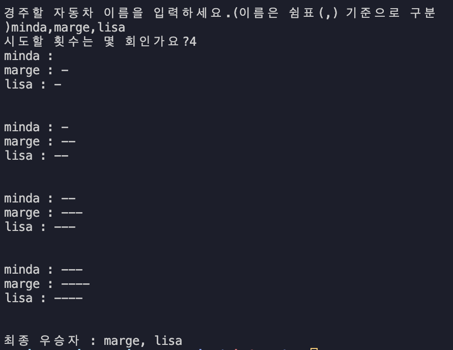

# 자동차 경주(Car Racing)

이 프로젝트는 우아한테크코스 프리코스 2주차 과제인 `무작위 값을 구해 4 이상이면 전진`하여 겨루는 **초간단 자동차 경주 게임**를 다루고 있습니다.

## 🎮 실행 결과 예시



## 🚀 기능 요구 사항

- 사용자가 몇 번 이동할 것인지 정하면 우승자를 구하는 초간단 자동차 경주 게임을 구현한다.

### 기능 목록

- 주어진 횟수 동안 n대의 자동차는 `전진 또는 멈춤`으로 동작한다.

##### 이름이 존재하는 n대의 자동차

- 자동차에 이름을 부여할 수 있다.
- 자동차 이름은 `,`로 구분하며 이름은 `5자 이하`만 가능하다.

```bash
pobi,woni,jun
```

##### 사용자가 입력하는 이동 횟수

- 사용자는 몇 번의 이동을 할 것인지 입력할 수 있다.

```bash
5
```

##### 전진 조건

- 전진 조건은 0에서 9 사이의 무작위 값을 구한 후 **무작위 값이 4 이상**인 경우다.

##### 우승자 출력

- 자동차 경주 게임을 완료한 후 `누가 우승`했는지 알려준다. 우승자는 **한 명 이상**일 수 있다.
- 우승자가 여러 명일 경우 `,`를 이용하여 구분한다.

```bash
pobi : --
woni : ----
jun : ---
```

```bash
최종 우승자 : pobi
```

```bash
최종 우승자 : pobi, jun
```

##### [ERROR]

- 사용자가 잘못된 값을 입력할 경우 [ERROR] 메시지와 함께 Error 발생 후 **애플리케이션 종료**된다.

```bash
경주할 자동차 이름을 입력하세요.(이름은 쉼표(,) 기준으로 구분)
pobiwonijun

[ERROR]
```

```bash
경주할 자동차 이름을 입력하세요.(이름은 쉼표(,) 기준으로 구분)
pobi,woni,jun
시도할 횟수는 몇 회인가요?
한

[ERROR]
```

### 입출력 요구 사항

##### 입력

- **경주할 자동차 이름** 자동차 이름은 `,`를 기준으로 구분하며 `5자 이하`로 제한  
  `pobi,woni,jun`

- **시도할 횟수** 몇 번 이동할 것인지 입력  
  `5`

##### 출력

- 차수별 실행 결과

  ```bash
  pobi : --
  woni : ----
  jun : ---
  ```

- 우승자 안내 문구 **공동 우승 가능**  
  `최종 우승자 : pobi` `최종 우승자 : pobi, jun`

##### 실행 결과 예시

```bash
경주할 자동차 이름을 입력하세요.(이름은 쉼표(,) 기준으로 구분)
pobi,woni,jun
시도할 횟수는 몇 회인가요?
5

실행 결과
pobi : -
woni :
jun : -

pobi : --
woni : -
jun : --

pobi : ---
woni : --
jun : ---

pobi : ----
woni : ---
jun : ----

pobi : -----
woni : ----
jun : -----

최종 우승자 : pobi, jun
```

---

## 🛠️ 구현 상세

#### 게임 초기화

- `initializeGame` 함수는 자동차 이름과 이동 횟수를 입력 받고 **유효성 검증** 후, 각 *자동차의 점수판을 초기화*합니다.

##### 코드 예시

```javascript
async function initializeGame() {
  const playerNames = await getPlayerNames();
  validatePlayerNames(playerNames);

  const moveCountInput = await Console.readLineAsync(MESSAGES.INPUT_MOVE_COUNT);
  validateMoveCount(moveCountInput);
  const moveCount = Number(moveCountInput);

  const playerScores = createScoreBoard(playerNames);
  return { playerScores, moveCount };
}
```

#### 게임 진행

- `runGame` 함수는 입력받은 횟수만큼 **게임을 진행**합니다. 각 라운드가 끝날 때마다 `자동차의 전진 여부`를 판단하고 점수를 업데이트하고 **우승자를 판별**합니다.

##### 코드 예시

```javascript
function runGame(playerScores, moveCount) {
  playRounds(playerScores, moveCount);
  Console.print(`${MESSAGES.WINNER_MESSAGE}${findWinners(playerScores)}`);
}
```

#### 전진 조건

- `무작위 값이 4 이상`인 경우에만 전진하며, 전진 여부에 따라 **플레이어 점수를 갱신**합니다.

##### 코드 예시

```javascript
function playGame(player) {
  if (Random.pickNumberInRange(0, 9) >= GAME_SETTINGS.MIN_SUCCESS_SCORE) {
    player.score += 1;
  }
}
```

#### 우승자 판별

- 모든 라운드가 종료되면 `최고 점수를 획득한 자동차`를 기준으로 *최종 우승자를 판별*합니다.
- 공동 우승을 허용합니다.

##### 코드 예시

```javascript
function findWinners(playerScores) {
  const maxScore = Math.max(...playerScores.map((player) => player.score));
  return playerScores
    .filter((player) => player.score === maxScore)
    .map((player) => player.name)
    .join(GAME_SETTINGS.PLAYER_NAME_DELIMITER);
}
```

##### 테스트 케이스

1. **입력**: `djfaksd,did` `불꽃코딩머신,불꽃코딩`

   - 처리: **5자를 초과하는 자동차 이름**
   - 결과: `[ERROR]`

2. **입력**: `pobi woni jun` `pobi|woni|jun `

   - 처리: **쉼표가 아닌 구분자**
   - 결과: `[ERROR]`

3. **입력**: `abc` `한`

   - 처리: **숫자가 아닌 시도 횟수**
   - 결과: `[ERROR]`

---

## 📄 테스트(Testing)

- 단위 테스트(Unit Testing)를 통해 예외 상황과 함수 동작을 검증했습니다.
- 테스트는 `Jest`를 사용했으며, 다음과 같은 **주요 함수**를 테스트했습니다.

### 주요 테스트 기능

1. 게임 초기화 테스트

- `유효한 자동차 이름과 이동 횟수 입력`에 대해 초기화가 이루어지고 그렇지 않은 입력에 에러가 발생하는지 검증합니다.

- 자동차 이름
  - 5자 이하이며 쉼표로 구분
  - 허용 가능한 특수문자는 `-_!:`
  - 중간 공백은 인정되나 **닉네임 앞뒤 공백은 이름에서 제외**

```javascript
return userInput.split(DELIMITER).map((e) => e.trim());
```

```javascript
expect(validatePlayerNames(['minda', 'sim?', 'java'])).toThrow(
  ERROR_MESSAGES.INVALID_PLAYER_NAME
);
```

- 이동 횟수
  - 양의 정수만 허용

```javascript
expect(validateMoveCount('-1')).toThrow(ERROR_MESSAGES.INVALID_MOVE_COUNT);
```

2. 게임 진행 로직

- 주어진 이동 횟수만큼 라운드가 진행되며, 라운드 결과가 `올바르게 출력`되는지 검증합니다.
- **테스트 시나리오**
  - 이동 횟수가 3회라면 **3번의 라운드**가 반복되어 각 라운드별로 전진 결과 출력
  - 각 라운드 종료 시 *모든 자동차의 점수판*이 올바르게 기록되는지 확인

```javascript
const inputs = ['minda,marge,lisa', '3'];
const randomValues = [5, 3, 4, 6, 2, 7, 9, 2, 8];
const expectedLogs = [
  'minda : -',
  'marge : ',
  'lisa : -',
  '\n',
  'minda : --',
  'marge : ',
  'lisa : --',
  '\n',
  'minda : ---',
  'marge : ',
  'lisa : ---',
  '\n',
  `${MESSAGES.WINNER_MESSAGE}minda, lisa`,
];

expectedLogs.forEach((log) => {
  expect(logSpy).toHaveBeenCalledWith(expect.stringContaining(log));
});
```

3.  전진 조건

- 무작위 숫자가 `4 이상일 때만` 자동차가 전진하는지 테스트합니다.
- **테스트 시나리오**
  - *4 이상일 때*만 점수가 1 증가
  - *3 이하일 때*는 정수가 변하지 않음

```javascript
jest
  .spyOn(MissionUtils.Random, 'pickNumberInRange')
  .mockReturnValue(GAME_SETTINGS.MIN_SUCCESS_SCORE);

playGame(car);
expect(car.score).toBe(1);
```

4. 우승자 판별 검증

- 게임 종료 후 *최고 점수*에 따라 우승자가 올바르게 판별되는지, 공동 우승자가 출력되는지 검증합니다.
- **시나리오**

  - 단일 우승자  
    `minda`가 최고 점수를 획득한 경우 최종 우승자는 `minda`

  ```javascript
  const playerScores = [
    { name: 'minda', score: 3 },
    { name: 'marge', score: 1 },
    { name: 'lisa', score: 0 },
  ];
  const winner = findWinners(playerScores);

  expect(winner).toBe('minda');
  ```

  - 공동 우승자  
    `marge`와 `lisa`가 최고 점수를 획득한 경우, 두 이름이 쉼표로 구분되어 출력

  ```javascript
  const playerScores = [
    { name: 'minda', score: 1 },
    { name: 'marge', score: 3 },
    { name: 'lisa', score: 3 },
  ];

  const winners = findWinners(playerScores);

  expect(winners).toBe('marge, lisa');
  ```

### 실행 방법

다음 명령어로 실행할 수 있습니다.

```bash
npm run test
```
