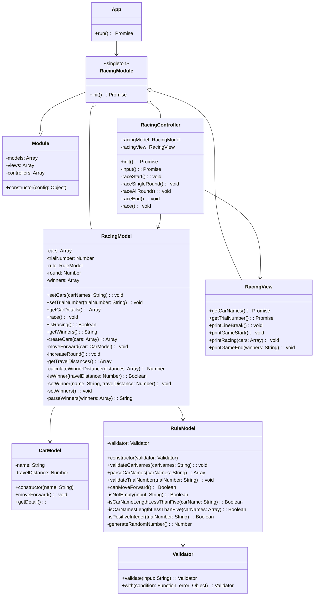

# javascript-racingcar-precourse

## 구현 기능 목록

### Order

- [x] 사용자로부터 자동차 이름을 입력 받는다.
- [x] 사용자로부터 시도할 횟수를 입력 받는다.
- [x] 입력받은 자동차의 이름을 콤마로 구분하고, 5자 이하인지 확인한다.
- [x] 사용자가 잘못된 자동차 이름을 입력한 경우 `Error`를 발생시킨 후 애플리케이션을 종료시킨다.
- [x] 사용자가 잘못된 시도 횟수를 입력한 경우 `Error`를 발생시킨 후 애플리케이션을 종료시킨다.
- [x] 사용자가 올바르게 입력한 경우 자동차 정보와 시도 횟수를 저장한다.
- [x] 입력받은 모든 자동차에 대해 시도 횟수 만큼 경주 게임을 진행한다.
- [x] 각각의 자동차는 0~9 사이의 무작위 값을 구한 뒤 무작위 값이 4이상인 경우 전진시킨다.
- [x] 게임이 완료된 경우 우승자를 보여준다.
- [x] 우승자가 여러 명일 경우 쉼표를 이용하여 구분해서 보여준다.

### Object

- Racing: 자동차 경주 게임과 관련된 역할을 담당한다.

  - View: 자동차 경주 게임에서 input, output을 담당한다.
  - Model: 자동차 경주 게임에서 데이터의 저장 및 가공을 담당한다.
  - Controller: 자동차 경주 게임의 실제 실행을 담당한다.

- Car: 자동차와 관련된 역할을 담당한다.
  - Model: 자동차와 관련된 데이터의 저장 및 가공을 담당한다.

## 구현 후

### 📁 Structure

```bash
src/
├── car/
│   ├── car.model.js
│   └── index.js
├── lib/
│   ├── Module.js
│   ├── testUtils.js
│   ├── utils.js
│   ├── Validator.js
│   └── view.js
├── racing/
│   ├── racing.controller.js
│   ├── racing.model.js
│   ├── racing.module.js
│   └── racing.view.js
├── rule/
│   └── rule.model.js
├── test/
│   ├── Module.test.js
│   ├── racing.model.test.js
│   ├── racing.view.test.js
│   ├── rule.model.test.js
│   ├── utils.test.js
│   └── view.test.js
├── App.js
└── index.js
```

### 📝 Description

- `MVC(Model-View-Controller)` 패턴을 적용하여 예측가능한 구조를 만들기 위해 노력하였습니다.
- `OOP(Object-Oriented Programming)` 관점에서 문제를 해결하기 위해 노력했습니다.
- `선언적인(Declarative)` 코드를 작성하기 위해 노력했습니다.
- 가능한 모든 함수에 테스트를 작성하기 위해 노력했습니다.
- `type-safe`한 코드를 작성하기 위해 노력했습니다.
- 가능한 작은 함수를 만들기 위해 노력했습니다.

### ♻️ Object


