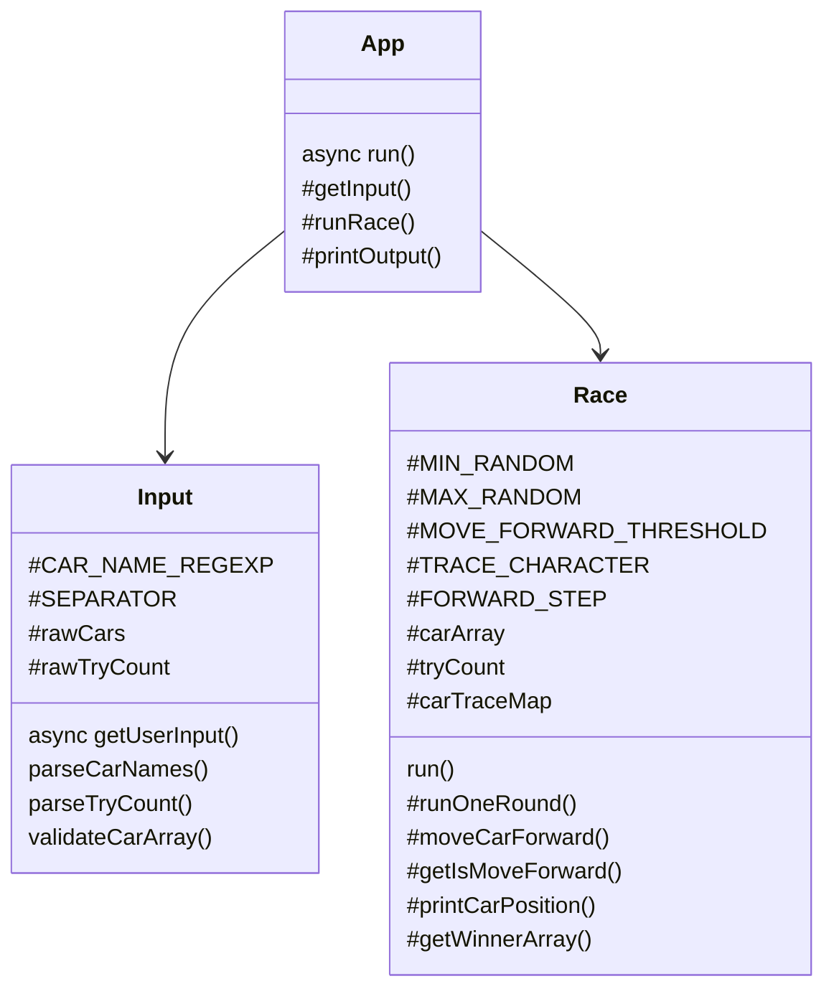

# javascript-racingcar-precourse

# 과제 이름

## 🔨 기능 구현 목록

### 입력 기능

1. 경주할 자동차 이름
   ```
      경주할 자동차 이름을 입력하세요.(이름은 쉼표(,) 기준으로 구분)
   ```
   - 쉼표를 기준으로 자동차 이름이 나뉜다.
   - [에외] 자동차 이름이 5자 초과인 경우
   - [에외] 자동차 이름이 1자 미만인 경우
   - [예외] 자동차 이름이 알파벳, 숫자 혹은 언더바(`_`)가 아닌 경우
2. 이동 횟수
   ```
      시도할 횟수는 몇 회인가요?
   ```
   - [예외] 양수가 아닌 경우
   - [예외] 정수가 아닌 경우

### 출력 기능

1. 차수별 실행 결과를 출력한다.
   ```
     pobi : -
     woni : ---
     jun : --
   ```
   - 여기서 이름 뒤에 오는 `-`의 개수는 누적된 전진 횟수를 의미한다.
2. 최종 우숭자를 출력한다.
   ```
     최종 우숭자 : pobi, jun
   ```
   - 최종 우숭자가 여러 명일 경우 쉼표(`,`)를 이용하여 구분한다.

### 동작 기능

1. 입력 기능의 1번을 수행한다.
2. 입력 기능의 2번을 수행한다.
3. 입력 1번의 값을 쉼표(`,`)를 기준으로 분리한다. 각 분리한 값은 자동차의 이름이다.
4. 0부터 9 사이에서 무작위 값을 구한다.
5. 값이 4이상이라면 자동차는 전진한다. 값이 4미만이라면 자동차는 멈춘다.
6. 출력 기능의 1번을 수행한다.
7. 입력 2번의 값만큼 동작 4번에서 6번 과정을 반복한다.
8. 출력 기능의 2번을 수행한다.

## 🧑🏻‍💻 실행 방법

1. Node.js 20.17.0 버전이 설치되었는지 확인한다.
2. `$ npm install`
3. `$ npm run start`

## 📂 폴더 구조

```
javascript-racingcar-7
├── package.json
├── README.md
├── __tests__
|  ├── ApplicationTest.js : App에 대한 테스트 코드
|  └── UtilsTest.js : util함수에 대한 테스트 코드
└── src
   ├── App.js : App 클래스
   ├── Input.js : Input 클래스, 입력을 담당한다.
   ├── Race.js : Race 클래스, 자동차 경주를 담당한다.
   ├── index.js
   └── lib
      ├── constants.js : 상수
      └── utils.js : 유틸 함수
```

## 📚 가장 신경 쓴 포인트

### 1. 객체지향 프로그래밍

1. 구조화

   이번 과제에서 가장 많이 고민한 점은 구조화예요. 처음에는 App 클래스에 모든 메서드를 등록했어요. '경주'라는 하나의 역할을 하는 App 클래스라고 생각했거든요. 하지만 더 깊게 생각해보니 이 역할도 '입력'과 '경주'라는 책임으로 나뉘더라고요. 여러 책임을 App에 모두 맡기면 나중에 수정하기가 어렵다는 것을 느꼈어요. 그래서 입력에 대한 책임은 `Input` 클래스에게, 자동차 경주에 대한 책임은 `Race` 클래스에게 맡겼어요. App에서는 이 Input 클래스와 Race 클래스를 호출해서 사용만 하면 돼요.

   그리고 각 입력과 자동차 경주에 필요한 상수는 각 클래스의 정적 private 프로퍼티로 설정했어요. 이렇게 상수가 아닌 프로퍼티로 설정함으로써 이 변수가 이 클래스, 즉 이 관심사에서만 쓰인다는 걸 알 수 있어요.

2. 데이터 변경과 확장에 용이

   1번의 구조화를 통해 데이터를 변경하거나 확장하는데에 용이해졌어요. 만약 전진하는 기준이 4가 아니라 7로 바꾸고 싶다면, Race클래스의 `MOVE_FORWARD_THRESHOLD` 프로퍼티를 수정하면 돼요. 또 만약 입력값의 구분자를 `,`뿐 아니라 `\`를 추가하고 싶다면 Input클래스의 `parseCars` 메서드와 `SEPARATOR` 프로퍼티를 수정하면 돼요. 하나의 클래스가 하나의 역할을 수행하기에 그 클래스만 수정하면 됩니다.

### 2. 함수형 프로그래밍

1. 순수함수의 조합

   함수형 프로그래밍은 부수효과를 최소화하고, 순수함수의 조합으로 프로그램을 작성하는 패러다임이에요. 각 클래스에서 필요한 함수를 최대한 순수 함수로 작성하기 위해 노력했어요. 여기서 순수함수란 동일한 인자에 항상 동일한 결과값을 출력하는 것을 말해요. 이러한 순수함수들은 `utils.js`라는 파일에 유틸함수로 따로 분리를 했어요.

2. 비상태와 불변성

   비상태는 함수형 프로그래밍의 특징 중 하나로, 주어진 인자로만 값으로만 결과값을 만들어내고, 외부 상태에 의존하지 않는 것을 의미해요.

   불변성은 기존 상태값을 변경하지 않는 것을 의미해요. 만약 값을 변경해야한다면 복사본을 만들어 이를 수정해야해요.

   위와 같은 특징을 지켜 확장에 용이하게, 그리고 부수효과를 줄이기 위해 노력했어요.

만약 특정 관심사에 종속되는 함수라면 그 관심사의 클래스 메서드로 선언했어요.

### 3. 단일 책임 원칙

하나의 함수가 하나의 '책임'만 가지도록 작성하기 위해 노력했어요.

## 🤔 고민했던 포인트

### 1. JSDoc 미사용

JSDoc을 사용할까 고민했어요. 하지만 실제로 적용해보니 코드의 절반 이상이 주석으로 덮여 가독성이 크게 떨어지더라고요. 그래서 JSDoc을 작성하지 않기로 했어요. 코드의 안정성보다 가독성을 선택한 것입니다. 대신 테스트 코드로 코드의 안정성을 확보할 수 있었어요.

## 🧑‍🏫 코드에 대한 설명

### 1. 일반 프로퍼티와 정적 프로퍼티의 구분

시간의 흐름에 따라 메서드를 실행하여 값이 변할 수 있는 값은 일반 프로퍼티, 메서드를 실행해도 값이 변하지 않는 값은 정적 프로퍼티로 설정하였습니다.

또한 일반 프로퍼티에 접근하는 메서드는 일반 메서드로, 일반 프로퍼티에 접근하지 않고 정적 프로퍼티에만 접근하는 메서드는 정적 프로퍼티로 설정하였습니다. 이 부분은 [javascript airbnb](https://github.com/airbnb/javascript?tab=readme-ov-file#classes--methods-use-this)에서 권장하는 방식이기도 합니다.

## 🧩 클래스 다이어그램


