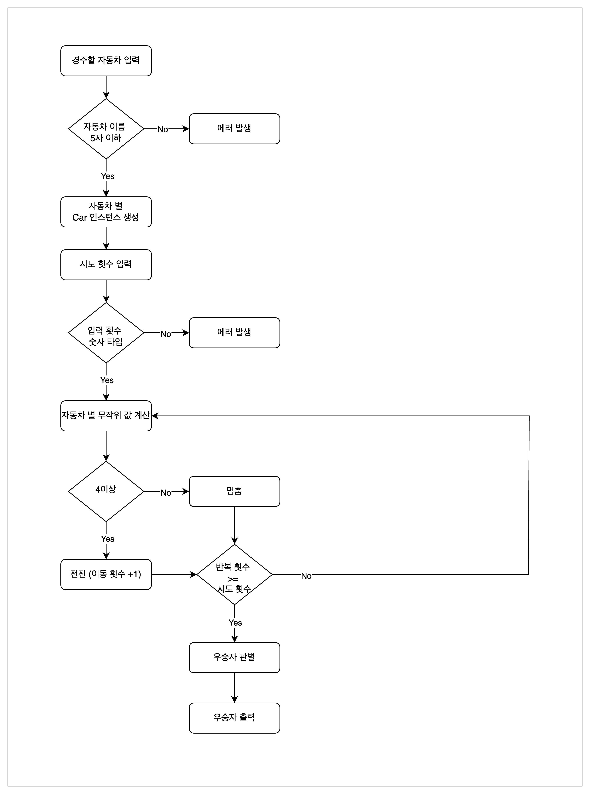

# [Week 2] 문자열 덧셈 계산기

## 📍 요구사항

자동차 경주 게임 구현

- 시도 횟수 동안 n대의 자동차는 전진 또는 멈춤
- 각 자동차에 이름 부여, 쉼표를 기준으로 구분하며 5자 이하로 입력
- 시도할 횟수 입력
- 0에서 9사이의 무작위 값을 구한 후, 4 이상인 경우 전진
- 자동차 이름을 포함하여 전진하는 자동차 출력
- 자동차 경주 게임 완료 후 우승자 출력, 여러 명일 경우 쉼표로 구분
- 잘못된 값 입력 시, 에러 발생 후 종료

## ✅ 구현해야 할 기능

- [] 경주할 자동차 이름 입력
- [] 자동차 이름 유효성 검증
- [] 각 자동차 별 Car 인스턴스 생성
  - [] 속성으로 이름과 이동 횟수 설정
- [] 시도할 횟수 입력
- [] 횟수가 숫자 타입인지 유효성 검증
- [] 자동차 별 무작위 값 계산
- [] 전진 및 멈춤 판단
- [] 차수별 실행 결과 출력
- [] 우승자 판별
- [] 우승자 출력
- [] 에러 처리

## 🖊️ 흐름도 설계

## 👩🏻‍💻 구현 내용 정리

## 🧐 어려웠던 점

## 📖 참고 사항
