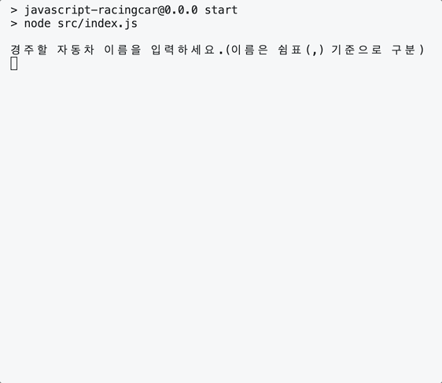

# javascript-racingcar-precourse
## 프리코스 2주 차 미션 - 자동차 경주
<p align='center'>

</p>

## 스스로 정한 규칙
- 입력된 이름은 두 개 이상이어야 한다.
  - 한 개일 때는 '경주'가 성립하지 않기 때문이다.
- 입력된 이름은 ‘공백을 포함한’ 문자열의 길이가 5 이하인 경우 **해당 문자열이 그대로 이름**이 된다.
    - 입력된 공백을 임의로 삭제하지 않는다.
    - ex) `     `도 길이가 5인 이름이라고 할 수 있다.
    - ex) `     `과 `  `은 길이가 다르기에 서로 다른 이름이다.
- 중복된 이름은 순서대로 출력된다.
  - '실행 결과'가 항상 출력되므로 사용자가 분간할 수 있기 때문이다.
- 이동 횟수가 0회인 경우 경주가 이루어지지 않기에 `error` 처리한다.
- 이름의 개수(n) 곱하기 시도 횟수(k)의 값은 $10^7$ 미만이어야 한다.
  - 프로그램 연산의 시간 복잡도 $O(n*k)$를 고려한다.

## 구현 기능 목록
- [x] 사용자 입력 요청 메시지 출력하기
  - [x] `경주할 자동차 이름을 입력하세요.(이름은 쉼표(,) 기준으로 구분)\n`
    - [x] 사용자로부터 n대 자동차의 이름 입력 받기
  - [x] `시도할 횟수는 몇 회인가요?`
    - [x] 사용자로부터 이동 횟수(`k`) 입력받기
- [x] 사용자 입력 검증 하기
  - [x] 한 개의 이름이 문자열의 길이가 5가 넘지 않으며, 쉼표(,)로 구분되는지 검증
  - [x] 시도 횟수 `k`는 1 이상의 정수만 입력
- [x] 게임 내에서 자동차를 객체로 관리하기
- [x] `k`회 반복하며 각 자동차에 대해 전진 또는 정지 결정
  - [x] 전진: 0과 9 사이 랜덤한 수 중 4 이상이 추출될 경우
  - [x] 정지: 0과 9 사이 랜덤한 수 중 4 미만이 추출될 경우
- [x] 반복 회차마다 실행 결과 출력하기
- [x] 가장 많이 전진한 자동차를 최종 우승자로 선정 _(여러 대일 수 있음)_ 하여 출력하기
  - [x] `최종 우승자 : pobi, jun`

## 예외 처리 목록

### 자동차 이름
- [x] 아무 것도 입력되지 않는 경우
- [x] 어떤 이름의 길이가 5 초과인 경우
- [x] 이름이 2개 미만 입력되는 경우
- [x] 이름 문자열 끝이 쉼표(,)로 끝나는 경우

### 시도 횟수
- [x] 아무 것도 입력되지 않는 경우
- [x] 숫자가 아닌 다른 값이 입력된 경우
- [x] `0`이 입력된 경우
- [x] `0`으로 시작되는 문자열인 경우

### 연산 횟수
- [x] 이름의 개수와 게임 시도 횟수를 곱한 값이 `1e7`을 초과하는 경우

## 폴더 구조
```
src
 ┣ components
 ┃ ┣ Car.js // 자동차 객체 관리 컴포넌트
 ┃ ┣ CarAllocator.js // 자동차 할당 및 분배 정보 처리 컴포넌트
 ┃ ┣ Game.js // 게임 진행과 상태를 관리하는 컴포넌트
 ┃ ┗ RoundManager.js // 게임 라우든 관리 및 진행 순서를 담당하는 컴포넌트
 ┣ resources
 ┃ ┣ Constants.js // App 전반에 사용되는 상수 정의한 파일
 ┃ ┣ ErrorMessage.js // Error 발생 시 출력 메시지를 정의한 파일
 ┃ ┣ RegularExpression.js // App에서 사용하는 정규표현식을 정의한 파일
 ┃ ┗ Rules.js // 게임 관련 규칙을 정의한 파일
 ┣ utils
 ┃ ┣ io
 ┃ ┃ ┣ Input.js // 사용자 입력을 처리하는 기능을 담은 유틸리티 파일
 ┃ ┃ ┗ Output.js // 출력 처리 기능을 담은 유틸리티 파일
 ┃ ┗ validation
 ┃ ┃ ┣ validateNames.js // 자동차 이름 관련 입력 유효성 검사를 수행하는 유틸리티 파일
 ┃ ┃ ┣ validateRepetitionString.js // 시도 횟수 입력 유효성 검사를 수행하는 유틸리티 파일
 ┃ ┃ ┗ validateTimeComplexity.js // 사용자 입력의 시간 복잡도 검사를 수행하는 유틸리티 파일
 ┣ App.js
 ┗ index.js
```