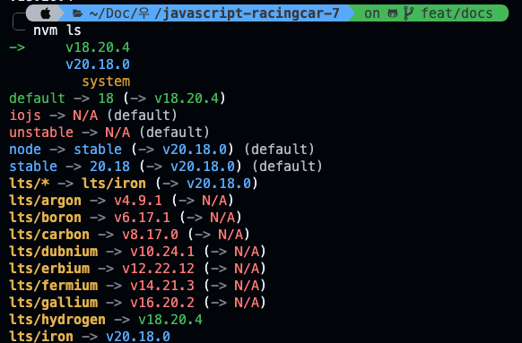

# javascript-racingcar-precourse

## 진행 방식 중 이전에 반영하지 않은 사항
- 기능을 구현하기 전에 기능 목록을 만들고, 기능 단위로 커밋할 것


## 기능
1. 사용자로 부터 구분자로 구분된 이름들과 시도할 횟수를 입력받는 함수(feat/inputFromConsole)
2. 이름들을 구분자로 나누어 초기값 0으로 셋팅한 배열 생성(feat/seperatedBySeperator)
> 예시 : [['john', 0], ['Lee', 0]]
3. 무작위 값을 생성하고 그 값이 4이상인 경우 true를 반환하고 아닌 경우 false를 반환하는 함수(feat/createRandomBoolean)
4. 입력받은 시도한 횟수만큼 진행한 후 거리값이 가장 큰 사람의 이름을 배열에 담아 출력하는 함수(feat/whoIsWinner)
> 출력하는 형식은 우승자가 한명이 경우와 여러명인 경우에 대해 다르게 처리할 필요가 있음
5. 사용자가 적절하지 않은 값을 입력한 경우에 대해서 Error메세지를 출력하는 에러핸들링 함수(feat/ErrorHandling)
6. 각각의 실행 결과에 대해서 그 시점에 대한 상황을 출력하는 함수(feat/logging)

## 유지 보수 시
1. 이름의 개수가 많은 경우에 대해서 우승자를 뽑아낼 때 다시 선형 검색을 할 경우 효율성이 떨어지므로 최댓값을 기억하여 최적화(feat/optimization)

## 현재 개발 추이
- [X] input from console
- [X] seperated By seperator
- [X] create Random boolean
- [X] who is winner?
- [X] Error handling
- [X] logging
- [X] middle test
- [] last test

## 중간 테스트 결과로 얻은 에러 목록
1. 이름이 5글자가 넘어가는 경우
> 이름은 ,를 제외한 나머지 문자로 구성된 문자열로 한다.
2. 이름이 빈 문자열인 경우
> ,,
3. 카운트 값을 입력받지 않은 경우 또는 카운트 값이 양의 정수 또는 0이 아닌 경우

### nvm으로 node버전 관리(다른 프로젝트와 병행 시)

#### 설치된 노드 버전 확인
```bash
nvm ls
```




#### 설치된 노드 버전으로 변경하기
```bash
nvm use 20.18.0
```


