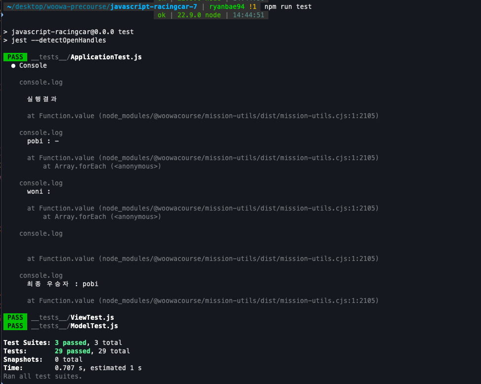
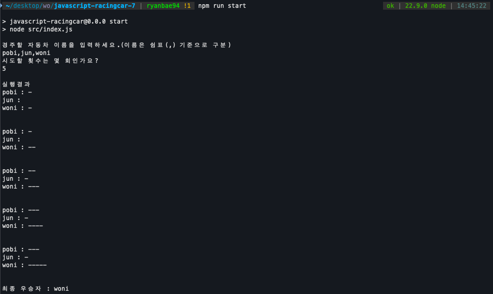

# javascript-racingcar-precourse

### 중점 구현 사항

_데이터의 흐름을 깔끔하게 다루기 위해 MVC 패턴을 적용_

1. 도메인 로직과 UI 로직의 분리

   - (M) 도메인 로직은 Car, Game에서 담당
   - (V) UI 로직은 InputView, OutputView
     - 입력 시 유효성 판단은 View에서 결정
   - (C) UI와 도메인을 연결하는 로직은 GameController에서 담당

2. 테스트 코드 작성

---

### 구현 과제 목록

#### Model

- CarModel 클래스
  - [x] 이름, 현재 위치 저장
  - [x] 이동 기능
- GameModel 클래스
  - [x] 자동차 이름 목록 저장
  - [x] 시도할 횟수 (라운드 수) 설정
  - [x] 라운드 별 결과 업데이트
  - [x] 우승자 결정

#### View

- InputView 클래스
  - [x] 사용자 이름 입력
  - [x] 시도할 횟수 입력
  - [x] 입력 형식 검증
- OutputView 클래스
  - [x] 라운드 별 진행 상태 출력
  - [x] 우승자 출력

#### Controller

- GameController 클래스

  - [x] 플레이어로부터 입력

    - [x] 입력받은 사용자 이름을 GameModel 클래스에 저장
    - [x] 입력받은 시도 횟수를 GameModel 클래스에 저장

  - [x] 라운드 진행

    - [x] GameModel 클래스로부터 라운드 별 진행 상황 전달
    - [x] GameModel 클래스로부터 우승자 전달

  - [x] 결과 출력

---

### 예외처리

- 이름 입력

  - [x] 이름이 5자를 초과할 때
  - [x] 이름에 공백이 들어갈 경우
  - [x] 아무것도 입력하지 않았을 경우
  - [x] 중복된 이름을 입력할 경우

- 시도 횟수 입력
  - [x] 숫자가 아닌 값이 입력되는 경우
  - [x] 정수가 아닌 값이 입력되는 경우
  - [x] 음수가 입력되는 경우
  - [x] 아무것도 입력하지 않았을 경우

---

### 결과

